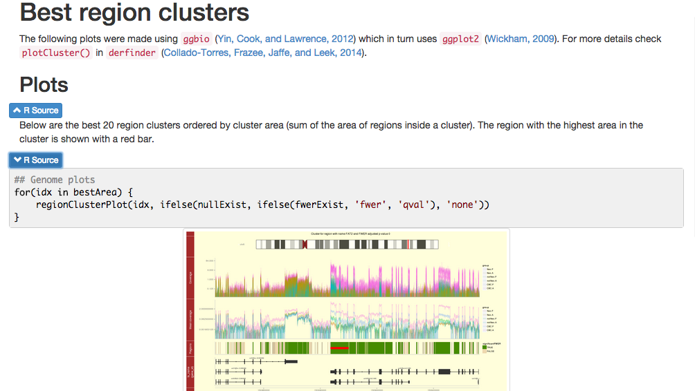
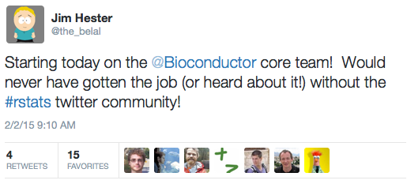

```{r vignetteSetup, echo=FALSE, message=FALSE, warning = FALSE}
## Track time spent on making the vignette
startTime <- Sys.time()

## Bib setup
library('knitcitations')

## Load knitcitations with a clean bibliography
cleanbib()
cite_options(hyperlink = 'to.doc', citation_format = 'text', style = 'html')
# Note links won't show for now due to the following issue
# https://github.com/cboettig/knitcitations/issues/63

## Write bibliography information
bibs <- c(knitcitations = citation('knitcitations'),
    knitrBootstrap = citation('knitrBootstrap'), 
    knitr = citation('knitr')[3],
    rmarkdown = citation('rmarkdown'),
    R = citation(),
    BiocParallel = citation('BiocParallel')
)

write.bibtex(bibs,
    file = 'BiocParallel-knitrBootstrap.bib')
bib <- read.bibtex('BiocParallel-knitrBootstrap.bib')

## Assign short names
names(bib) <- names(bibs)

library('BiocParallel')
runSlow <- TRUE
```

##

* Presentation: [lcolladotor.github.io/BiocParallel-knitrBootstrap/](http://lcolladotor.github.io/BiocParallel-knitrBootstrap/)
* R code: [lcolladotor.github.io/BiocParallel-knitrBootstrap/index.R](http://lcolladotor.github.io/BiocParallel-knitrBootstrap/index.R)

## Installation

This is a short introduction on how to use `BiocParallel` `r citep(bib[['BiocParallel']])` and `knitrBootstrap` `r citep(bib[['knitrBootstrap']])`.

You will need R 3.1.2 or newer (available from [CRAN](http://cran.r-project.org/)) and [BiocParallel](http://bioconductor.org/packages/release/bioc/html/BiocParallel.html)

```{r 'install', eval = FALSE}
## Install BiocParallel
source('http://bioconductor.org/biocLite.R')
biocLite('BiocParallel')
```

You will also need [knitrBootstrap](https://github.com/jimhester/knitrBootstrap)

```{r 'install2', eval = FALSE}
## If needed:
# install.packages('devtools')
devtools::install_github('jimhester/knitrBootstrap')
```


## Docs

You can find the latest documentation at

* [Introduction to BiocParallel](http://bioconductor.org/packages/devel/bioc/vignettes/BiocParallel/inst/doc/IntroductionToBiocParallel.pdf) vignette
* [knitrBootstrap README](https://github.com/jimhester/knitrBootstrap/blob/master/README.md)
* help pages

```{r 'rhelp', eval = FALSE}
help(package = 'BiocParallel')
help(package = 'knitrBootstrap')
```


## Parallel computing?

## Hm...

<a href='http://gnoted.com/wp-content/uploads/2012/02/cloud_43-595x553.jpg'></a>

[Source](http://gnoted.com/wp-content/uploads/2012/02/cloud_43-595x553.jpg)

##

<a href='http://www.mathworks.com/cmsimages/63635_wl_91710v00_po_fig2_wl.gif'></a>

[Source](http://www.mathworks.com/cmsimages/63635_wl_91710v00_po_fig2_wl.gif)


## 

```{r}
plot(y = 10 / (1:10), 1:10, xlab = 'Number of cores', ylab = 'Time',
    main = 'Ideal scenario', type = 'o', col = 'blue',
    cex = 2, cex.axis = 2, cex.lab = 1.5, cex.main = 2, pch = 16)
```

## 

```{r}
plot(y = 10 / (1:10), 1:10, xlab = 'Number of cores', ylab = 'Time',
    main = 'Reality', type = 'o', col = 'blue',
    cex = 2, cex.axis = 2, cex.lab = 1.5, cex.main = 2, pch = 16)
lines(y = 10 / (1:10) * c(1, 1.05^(2:10) ), 1:10, col = 'red',
    type = 'o', cex = 2)
```

## {.flexbox .vcenter}

[CRAN Task View: High-Performance and Parallel Computing with R](http://cran.r-project.org/web/views/HighPerformanceComputing.html)

<a href='http://thumbs.dreamstime.com/x/word-cloud-parallel-computing-27198811.jpg'></a>

[Source](http://thumbs.dreamstime.com/x/word-cloud-parallel-computing-27198811.jpg)


## BiocParallel authors

<div class="columns-2">
  <a href='https://github.com/mtmorgan'></a>

  <a href='https://github.com/DarwinAwardWinner'></a>

  <a href='https://github.com/mllg'></a>

  - Martin Morgan
  - Ryan Thompson
  - Michel Lang
  - [Valerie Obenchain](https://github.com/vobencha) (couldn't find pic)
</div>


## Birthday example

```{r}
birthday <- function(n) {
    m <- 10000
    x <- numeric(m)
    for(i in 1:m) {
        b <- sample(1:365, n, replace = TRUE)
        x[i] <- ifelse(length(unique(b)) == n, 0, 1)
    }
    mean(x)
}
```

```{r, eval = runSlow}
system.time( lapply(1:100, birthday) )
```


[Source](http://www.slideshare.net/RevolutionAnalytics/introducing-revolution-r-open-enhanced-open-source-r-distribution-from-revolution-analytics) slide 24


## Via doMC

```{r, eval = runSlow}
library('doMC')
registerDoMC(2)
system.time( x <- foreach(j = 1:100) %dopar% birthday(j) )
```

> * Have to change code
> * Want to try another parallel mode? Change code again

## Via BiocParallel

```{r, eval = runSlow}
library('BiocParallel')
system.time( y <- bplapply(1:100, birthday) )
```

> * Very easy: change lapply() to `bp`lapply()
> * Can set global options

## Registered modes {.smaller}

```{r}
registered()
```

## Change modes

```{r}
## Test in serial mode
system.time( y.serial <- bplapply(1:10, birthday,
    BPPARAM = SerialParam()) )

## Try Snow
system.time( y.snow <- bplapply(1:10, birthday, 
    BPPARAM = SnowParam(workers = 2)) )
```

## Use in JHPCE {.smaller}

```
$ R
> library('BiocParallel')
> registered()
$MulticoreParam
class: MulticoreParam; bpisup: TRUE; bpworkers: 8; catch.errors: TRUE
setSeed: TRUE; recursive: TRUE; cleanup: TRUE; cleanupSignal: 15;
  verbose: FALSE

$SnowParam
class: SnowParam; bpisup: FALSE; bpworkers: 8; catch.errors: TRUE
cluster spec: 8; type: PSOCK

$BatchJobsParam
class: BatchJobsParam; bpisup: TRUE; bpworkers: NA; catch.errors: TRUE
cleanup: TRUE; stop.on.error: FALSE; progressbar: TRUE

$SerialParam
class: SerialParam; bpisup: TRUE; bpworkers: 1; catch.errors: TRUE
```

## BatchJobs

> * Submits jobs for you in many cluster environments
> * Lots of docs: [rdocumentation.org/packages/BatchJobs](http://www.rdocumentation.org/packages/BatchJobs/functions/BatchJobs)
> * Also https://github.com/tudo-r/BatchJobs/wiki/Configuration

## .BatchJobs.R file

```{r, eval = FALSE}
cluster.functions = makeClusterFunctionsSGE("~/simple.tmpl")
mail.start = "none"
mail.done = "none"
mail.error = "none"
staged.queries = TRUE
fs.timeout = 10
```

Via [Prasad Patil](http://www.biostat.jhsph.edu/~prpatil/)


## simple.tmpl file

```bash
#!/bin/bash
# Job name
#$ -N <%= job.name %>
# Use current directory
#$ -cwd 
# Get emails
#$ -m e

R CMD BATCH --no-save --no-restore "<%= rscript %>" /dev/stdout
exit 0
```

Modified from [Prasad's](http://www.biostat.jhsph.edu/~prpatil/) version. 

I like emails to then explore stats using Alyssa's [efficency SGE  analytics](http://alyssafrazee.com/efficiency-analytics.html): [code](http://figshare.com/articles/efficiency_analytics/878000).

## General simple.tmpl file {.smaller}

```bash
#!/bin/bash

# The name of the job, can be anything, simply used when displaying the list of running jobs
#$ -N <%= job.name %>
# Combining output/error messages into one file
#$ -j y
# Giving the name of the output log file
#$ -o <%= log.file %>
# One needs to tell the queue system to use the current directory as the working directory
# Or else the script may fail as it will execute in your top level home directory /home/username
#$ -cwd
# use environment variables
#$ -V
# use correct queue 
#$ -q <%= resources$queue %>
# use job arrays
#$ -t 1-<%= arrayjobs %>

# we merge R output with stdout from SGE, which gets then logged via -o option
R CMD BATCH --no-save --no-restore "<%= rscript %>" /dev/stdout
exit 0
```

[Source](https://github.com/tudo-r/BatchJobs/blob/master/examples/cfSGE/simple.tmpl)


## Actually using it

```{r, eval = FALSE}
library('BiocParallel')
library('BatchJobs')

# define birthday() function

## Register cluster
funs <- makeClusterFunctionsSGE("~/simple.tmpl")
param <- BatchJobsParam(workers = 10, resources = list(ncpus = 1),
    cluster.functions = funs)
register(param)

## Run
system.time( xx <- bplapply(1:100, birthday) )

## Jobs spend a little bit of time in the queue
#   user  system elapsed
#  0.597   0.350  31.644
```

## Important note

For developers:

```
Developers wishing to invoke back-ends other than MulticoreParam
need to take special care to ensure that required packages, data,
and functions are available and loaded on the remote nodes.
```

Source: [BiocParallel vignette](http://bioconductor.org/packages/devel/bioc/vignettes/BiocParallel/inst/doc/IntroductionToBiocParallel.pdf)

## Why should I use `BiocParallel`?

> * Simple to use
> * Try different parallel backends without changing code
> * Can use it to submit cluster jobs
> * Great support from Bioconductor team


##


## HTML reports

People like them because

> * easy to share
> * we all use the web
> * can have interactive features

##

<a href='https://rawgit.com/yihui/knitr-examples/master/003-minimal.html'></a>

[Source](https://rawgit.com/yihui/knitr-examples/master/003-minimal.html)

##

* `rmarkdown` `r citep(bib[['rmarkdown']])` has simplified the process
* http://rmarkdown.rstudio.com/

<a href='http://rmarkdown.rstudio.com/'></a>

[Source](http://rmarkdown.rstudio.com/)

## knitrBootstrap

[Creating awesome reports for multiple audiences using knitrBootstrap](http://lcolladotor.github.io/2013/12/10/knitrBootstrap/#.VRzPvTvF90s)

> * Idea:
> * One document with code and output
> * Hide code by default
> * Users who like code, can easily look at it
> * Users who don't need code don't get confused by it

## Example myFile.Rmd


```
---
output:
  knitrBootstrap::bootstrap_document:
    theme.chooser: TRUE
    highlight.chooser: TRUE
---

Title
====

Etc
```

Then render:

```{r, eval = FALSE}
rmarkdown::render('myFile.Rmd')
```


## Useful chunk options

```
bootstrap.show.code = FALSE
bootstrap.show.warning = FALSE
bootstrap.show.message = FALSE
```


##

<a href='http://lcolladotor.github.io/regionReportSupp/brainspan/basicExploration.html#Best_region_clusters'></a>

##

<a href='http://lcolladotor.github.io/regionReportSupp/brainspan/basicExploration.html#Best_region_clusters'></a>


## {.flexbox .vcenter}

<a href='https://twitter.com/bioconductor/status/530785622907047937'></a>

## {.flexbox .vcenter}

<a href='https://twitter.com/the_belal/status/562251823726473216'></a>


## Need help?

* Post in the [Bioconductor support site](https://support.bioconductor.org/) -- remember to use the `BiocParallel` tag!
* For `knitrBootstrap`, open a new [issue in the GitHub repo](https://github.com/jimhester/knitrBootstrap/issues)


## Citing them {.smaller}

```{r 'citation'}
## Citation info
citation('BiocParallel')

```

## {.smaller}

```{r 'citation2'}
citation('knitrBootstrap')
```


## Reproducibility {.smaller}

Code for creating this page

```{r createVignette, eval=FALSE}
## Create this page
library('rmarkdown')
render('index.Rmd')

## Clean up
file.remove('BiocParallel-knitrBootstrap.bib')

## Extract the R code
library('knitr')
knit('index.Rmd', tangle = TRUE)
```

Date this tutorial was generated.

```{r reproducibility1, echo=FALSE}
## Date the vignette was generated
Sys.time()
```

Wallclock time spent running this tutorial.

```{r reproducibility2, echo=FALSE}
## Processing time in seconds
totalTime <- diff(c(startTime, Sys.time()))
round(totalTime, digits=3)
```

## {.smaller}

`R` session information.

```{r reproducibility3, echo=FALSE}
## Session info
library('devtools')
options(width = 120)
session_info()$platform
```

## {.smaller}

```{r reproducibility4, echo=FALSE}
## Session info packages
session_info()$packages
```

## Bibliography {.smaller}

This tutorial was generated using `rmarkdown` `r citep(bib[['rmarkdown']])` and `knitcitations` `r citep(bib[['knitcitations']])`.

```{r vignetteBiblio, results = 'asis', echo = FALSE, warning = FALSE}
## Print bibliography
bibliography()
```

